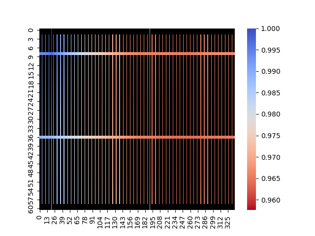

# Neural Network for IR-Drop Prediction in Integrated Circuits
This repository contains a conventional neural network model designed to predict the IR-drop of macro-block circuits in integrated circuits. The purpose of this project is to develop an accurate and efficient model for estimating the IR-drop, which is an important factor in analyzing the performance and reliability of integrated circuits.

## Testing

To evaluate the performance of the neural network model, testing was conducted using the OpenLane project. OpenLane was utilized to generate real spice-netlist files from Verilog descriptions. The generated spice-netlists were then used as input for the neural network model, allowing for accurate prediction of the IR-drop.

The testing results for various integrated circuits are as follows:

| Circuit       | Error in % | NN time | go-spice time | Time diff |
|---------------|------------|---------|---------------|-----------|
| APU           | 0.18553%   | 0.515s   | 18.33s         | 35.5      |
| GCD           | 0.79802%   | 0.1585s  | 53.21s         | 335.7     |
| mem_v1r1      | 0.07101%   | 0.0987s  | 8.66s          | 87.7      |
| wbqspiflash   | 0.5811%    | 0.11789s | 11.7s          | 100       |
| xtea          | 0.12282%   | 0.08216s | 9.53s          | 116.8     |
| zipdiv        | 0.17582%   | 0.13105s | 6.88s          | 52.4      |

The predictions obtained from the neural network model were compared with the results obtained from a program called [go-spice](https://github.com/AlaieT/go-spice), which is used for calculating IR-drop. This allows for a comprehensive analysis of the accuracy and reliability of the neural network model.

### Example




## Repository Contents
- `utils` - project utils like as models, reader and e.t.c
- `analisys.py` - analisys generated data on ir-drop(min, max and mean) depending on threshold value(max ir-drop from voltage source value in %)
- `draw.py` - draw spice-netlist image
- `generator.py` - generate train dataset of integrate circuits
- `predict.py` - predict spice-netlist ir-drop
- `test.py` - performing test on test dataset, it has to include: spice-netlis and ir-drop solutioins in csv formate
- `train.py` - performing train on train dataset, it has to include: spice-netlis and ir-drop solutioins in csv formate

## Usage
### Generate
To generate tranning dataset just execute `generate.py`


```
python generate.py -p ./assets/train -w [300000, 350000, 400000] -d1 [30, 35, 40, 45, 55] -d45 [2, 3, 4, 6, 8] -s [15, 20, 25, 30] -p [15, 20, 25, 30]
```

Where:
- -p --path - path to trina dataset folder
- -w --width - array of circuits withd/height
- -d1 --denisty1 - array of ammount of reils in 1st metal layer
- -d45 --denisty45 - array of ammount of reuls in 4th and 5th layers at the same time
- -s --split_level - array of max ammount of current sources on each of 1st layer's reils
- -p --padding - array of padding values for circuit

### Train
To trian model you should have train dataset, it is should contain spice-netlists and ir-drop solutions in csv formate - `[node_name, value]`. Also you need a csv file that contains all train data - `[path_to_netlist, path_to_soution]`. Then you can run train just execute `train.py`

```
python train.py -ft ./assets/train.csv -e 1500 -bt 128 -r
```

Where:
- -ft --file_train - path to train .csv file
- -fv --file_valid - path to validation (if needed) .csv file.
- -e --epochs - ammount of train epochs
- -bt -- batch_size_train - size of train batch
- -bv -- batch_size_valid - size of validation batch
- -r --resave - resave .pt files

### Test
To test model on test dataset just execute `test.py`

```
python test.py -p --path ./assets/test -s --scaler ./dict/scaler/scaler.pkl -m ./dict/dnn/best.pt
```

Where:
- -p --path - path to test folder
- -s --scaler - path to dataset scaler file (creates during train)
- -m --model - path to model file


