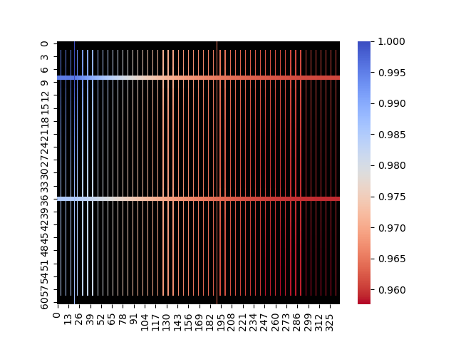

# pytorch-spice-cnn
[](https://www.python.org/)
[](https://opensource.org/licenses/MIT)

This repository contains a conventional neural network model designed to predict the IR-drop of macro-block circuits in integrated circuits. The purpose of this project is to develop an accurate and efficient model for estimating the IR-drop, which is an important factor in analyzing the performance and reliability of integrated circuits.

## Testing

To evaluate the performance of the neural network model, testing was conducted using the OpenLane project. OpenLane was utilized to generate real spice-netlist files from Verilog descriptions. The generated spice-netlists were then used as input for the neural network model, allowing for accurate prediction of the IR-drop.

The testing results for various integrated circuits are as follows:

| Circuit       | Error (%) | NN Time | go-spice Time | Time Difference |
|---------------|------------|---------|---------------|-----------------|
| APU           | 0.18553    | 0.515s  | 18.33s        | 35.5            |
| GCD           | 0.79802    | 0.1585s | 53.21s        | 335.7           |
| mem_v1r1      | 0.07101    | 0.0987s | 8.66s         | 87.7            |
| wbqspiflash   | 0.5811     | 0.11789s| 11.7s         | 100             |
| xtea          | 0.12282    | 0.08216s| 9.53s         | 116.8           |
| zipdiv        | 0.17582    | 0.13105s| 6.88s         | 52.4            |

The predictions obtained from the neural network model were compared with the results obtained from a program called [go-spice](https://github.com/AlaieT/go-spice), which is used for calculating IR-drop. This allows for a comprehensive analysis of the accuracy and reliability of the neural network model.

### Example

**APU - Real**             |  **APU - Prediction**
:-------------------------:|:-------------------------:
  |  

## Repository Contents

- `utils` - project utilities such as models, readers, etc.
- `analysis.py` - analyze generated data on IR-drop (minimum, maximum, and mean) depending on threshold value (maximum IR-drop from voltage source value in %)
- `draw.py` - draw spice-netlist image
- `generate.py` - generate training dataset of integrated circuits
- `predict.py` - predict spice-netlist IR-drop
- `test.py` - perform tests on the test dataset, which includes spice-netlists and IR-drop solutions in CSV format
- `train.py` - perform training on the train dataset, which includes spice-netlists and IR-drop solutions in CSV format

## Usage

### Generate

To generate training dataset, execute `generate.py`:

```shell
python generate.py -p ./assets/train -w [300000, 350000, 400000] -d1 [30, 35, 40, 45, 55] -d45 [2, 3, 4, 6, 8] -s [15, 20, 25, 30] -p [15, 20, 25, 30]
```

Where:
- `-p`, `--path` - path to the training dataset folder
- `-w`, `--width` - array of circuit widths/heights
- `-d1`, `--density1

` - array of the number of rails in the 1st metal layer
- `-d45`, `--density45` - array of the number of rails in the 4th and 5th layers at the same time
- `-s`, `--split_level` - array of the maximum number of current sources on each of the 1st layer's rails
- `-p`, `--padding` - array of padding values for the circuit

### Train

To train the model, you need a training dataset that contains spice-netlists and IR-drop solutions in CSV format, along with a CSV file that contains all the training data - `[path_to_netlist, path_to_solution]`. Then, execute `train.py`:

```shell
python train.py -ft ./assets/train.csv -e 1500 -bt 128 -r
```

Where:
- `-ft`, `--file_train` - path to the train CSV file
- `-fv`, `--file_valid` - path to the validation (if needed) CSV file
- `-e`, `--epochs` - number of training epochs
- `-bt`, `--batch_size_train` - size of the training batch
- `-bv`, `--batch_size_valid` - size of the validation batch
- `-r`, `--resave` - resave .pt files

### Test

To test the model on the test dataset, execute `test.py`:

```shell
python test.py -p --path ./assets/test -s --scaler ./dict/scaler/scaler.pkl -m ./dict/dnn/best.pt
```

Where:
- `-p`, `--path` - path to the test folder
- `-s`, `--scaler` - path to the dataset scaler file (created during training)
- `-m`, `--model` - path to the model file

## Contribution

Contributions to this project are welcome and appreciated. If you find any issues, have suggestions for improvements, or want to add new features, please feel free to submit a pull request.

Please ensure that your contributions align with the project's coding style and follow best practices. Also, make sure to test your changes thoroughly before submitting a pull request.

## License

This project is licensed under the MIT License. Feel free to use and modify the code for your own purposes.
